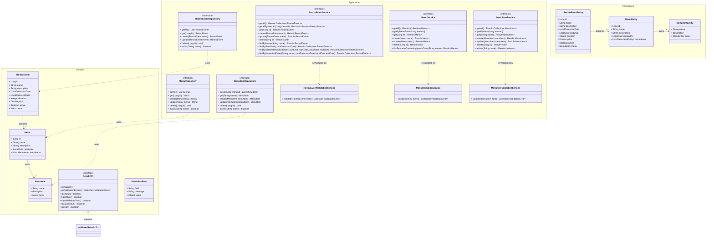

```mermaid
classDiagram
    namespace Domain{

        class RestroEvent{
            + Long id
            + String name
            + String description
            + LocalDate startDate
            + LocalDate endDate
            + Integer duration
            + Double price
            + Boolean active
            + Menu menu
        }

        class Menu{
            + Long id
            + String name
            + String description
            + LocalDate createdAt
            + List~MenuItem~ menuItems
        }

        class MenuItem{
            + String name
            + description
            + Menu menu
        }

        class Result~T~ {
            <<interface>>
            +getValue() T
            +getValidationErrors() Collection~ValidationError~
            +isEmpty() boolean
            +hasValue() boolean
            +hasValidationError() boolean
            +isSuccessful() boolean
            +isError() boolean
        }

        class ValidationError {
            + String field
            + String message
            + Object value
        }
    }

    namespace Application{

         class RestroEventService {
            <<interface>>
            + getAll() Result~Collection~RestroEvent~~
            + getAllByMenuId(Long menuId) Result~Collection~RestroEvent~~
            + get(Long id) Result~RestroEvent~
            + create(RestroEvent event) Result~RestroEvent~
            + update(RestroEvent event) Result~RestroEvent~
            + delete(Long id) Result~void~
            + findByName(String name) Result~RestroEvent~
            + findByStartDate(LocalDate startDate) Result~Collection~RestroEvent~~
            + findByStartDateAndEndDate(LocalDate startDate,LocalDate endDate) Result~Collection~RestroEvent~~
            + findByNameAndDates(String name,LocalDate startDate,LocalDate endDate) Result~Collection~RestroEvent~~
        }

        class MenuService {
            <<interface>>
            + getAll() Result~Collection~Menu~~
            + getByMenuEvent(Long eventId)
            + get(Long id) Result~Menu~
            + create(Menu menu) Result~Menu~
            + update(Menu menu) Result~Menu~
            + delete(Long id) Result~void~
            + findByNameContainingIgnoreCase(String name) Result~Menu~
        }

         class MenuItemService{
            <<interface>>
            + getAll() Result~Collection~MenuItem~~
            + getByMenu(Long menuId)
            + get(String name) Result~MenuItem~
            + create(MenuItem menuItem) Result~MenuItem~
            + update(MenuItem menuItem) Result~MenuItem~
            + delete(Long id) Result~void~
            + exists(String name) Result~boolean~
        }

          class RestroEventRepository {
            <<interface>>
            + getAll() List~RestroEvent~
            + get(Long id) RestroEvent
            + create(RestroEvent event) RestroEvent
            + update(RestroEvent event) RestroEvent
            + delete(Long id) void
            + exists(String name) boolean
        }

         class MenuRepository {
            <<interface>>
            + getAll() List~Menu~
            + get(Long id) Menu
            + create(Menu menu) Menu
            + update(Menu menu) Menu
            + delete(Long id) void
            + exists(String name) boolean
        }

          class MenuItemRepository {
            <<interface>>
            + getAll(Long menuId) List~MenuItem~
            + get(String name) MenuItem
            + create(MenuItem menuItem) MenuItem
            + update(MenuItem menuItem) MenuItem
            + delete(Long id) void
            + exists(String name) boolean
        }


        class RestroEventValidationService{
            + validate(RestroEvent event) Collection~ValidationError~
        }


        class MenuValidationService{
            + validate(Menu menu) Collection~ValidationError~
        }

        class MenuItemValidationService{
            + validate(MenuItem item) Collection~ValidationError~
        }
    }

    namespace Persistence {

        class RestroEventEntity{
            + Long id
            + String name
            + String description
            + LocalDate startDate
            + LocalDate endDate
            + Integer duration
            + Double price
            + Boolean active
            + MenuEntity menu
        }

        class MenuEntity {
            + Long id
            + String name
            + String description
            + LocalDate createdAt
            + List~MenuItemEntity~ menuItems
        }

        class MenuItemEntity{
            + String name
            + description
            + MenuEntity menu
        }
    }

    %% Domain RelationShips
    Menu --> "0..*" MenuItem : owns
    RestroEvent --> "0..1" Menu : optional

    %% Persistence RelationShips
    MenuEntity --> "0..*" MenuItemEntity : owns
    RestroEventEntity --> "0..1" MenuEntity : optional

    %% Application Dependencies
    RestroEventService ..> RestroEventValidationService : is Validated By
    MenuService ..> MenuValidationService : is Validated By
    MenuItemService ..> MenuItemValidationService : is Validated By

    %% Inheritane Relationships
    Result~T~ <|-- ValidatedResult~T~ : extends


    RestroEventRepository ..> RestroEvent : uses
    MenuRepository ..> Menu : uses
    MenuItemRepository ..> MenuItem : uses
```
