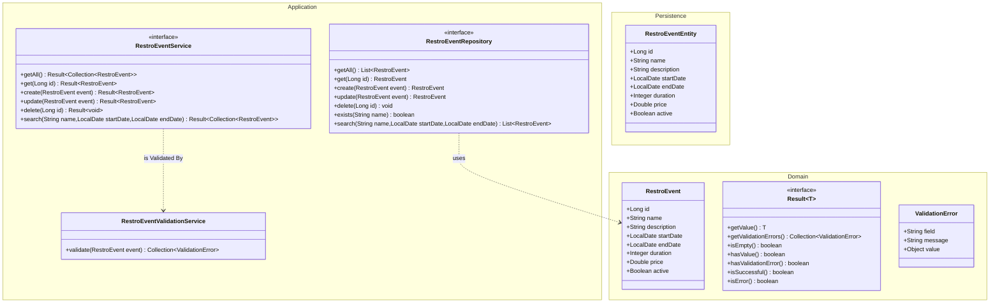

```mermaid
classDiagram
    namespace Domain{
        
        class RestroEvent{
            +Long id
            +String name
            +String description
            +LocalDate startDate
            +LocalDate endDate
            +Integer duration
            +Double price
            +Boolean active
        }

        class Result~T~ {
            <<interface>>
            +getValue() T
            +getValidationErrors() Collection~ValidationError~
            +isEmpty() boolean
            +hasValue() boolean
            +hasValidationError() boolean
            +isSuccessful() boolean
            +isError() boolean
        }

        class ValidationError {
            +String field
            +String message
            +Object value
        }
    }

    namespace Application{

        class RestroEventService {
            <<interface>>
            +getAll() Result~Collection~RestroEvent~~
            +get(Long id) Result~RestroEvent~
            +create(RestroEvent event) Result~RestroEvent~
            +update(RestroEvent event) Result~RestroEvent~
            +delete(Long id) Result~void~
            +search(String name,LocalDate startDate,LocalDate endDate) Result~Collection~RestroEvent~~
        }
        class RestroEventRepository {
            <<interface>>
            +getAll() List~RestroEvent~
            +get(Long id) RestroEvent
            +create(RestroEvent event) RestroEvent
            +update(RestroEvent event) RestroEvent
            +delete(Long id) void
            +exists(String name) boolean
            +search(String name,LocalDate startDate,LocalDate endDate) List~RestroEvent~
        }

        class RestroEventValidationService{
            +validate(RestroEvent event) Collection~ValidationError~
        }
    }

    namespace Persistence {
         class RestroEventEntity{
            +Long id
            +String name
            +String description
            +LocalDate startDate
            +LocalDate endDate
            +Integer duration
            +Double price
            +Boolean active
        }
    }

     RestroEventRepository ..> RestroEvent : uses
     RestroEventService ..> RestroEventValidationService : is Validated By
```