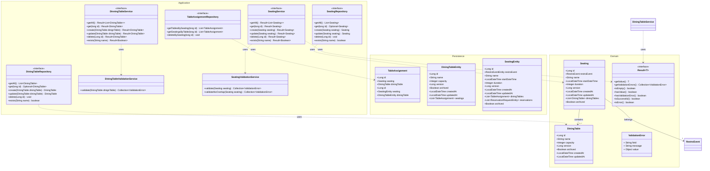

```mermaid
classDiagram
    namespace Domain {
        
        class DiningTable {
            +Long id
            +String name
            +Integer capacity
            +Long version
            +Boolean archived
            +LocalDateTime createdAt
            +LocalDateTime updatedAt
        }

        class Seating {
            +Long id
            +RestroEvent restroEvent                 
            +String name
            +LocalDateTime startDateTime
            +Integer duration           
            +Long version
            +LocalDateTime createdAt
            +LocalDateTime updatedAt
            +List~DiningTable~ diningTables
            +Boolean archived
        }

        class TableAssignment {
            +Long id
            +Seating seating
            +DiningTable diningTable
        }

        class Result~T~ {
            <<interface>>
            +getValue() T
            +getValidationErrors() Collection~ValidationError~
            +isEmpty() boolean
            +hasValue() boolean
            +hasValidationError() boolean
            +isSuccessful() boolean
            +isError() boolean
        }

        class ValidationError {
            + String field
            + String message
            + Object value
        }
    }

    namespace Application {

        class DinningTableService {
            <<interface>>
            +getAll() Result~List~DiningTable~~
            +get(long id) Result~DiningTable~
            +create(DiningTable dinignTable) Result~DiningTable~
            +update(DiningTable diningTable) Result~DiningTable~
            +delete(Long id) Result~DiningTable~
            +exists(String name) Result~Boolean~
        }

        class SeatingService {
            <<interface>>
            +getAll() Result~List~Seating~~
            +get(long id) Result~Seating~
            +create(Seating seating) Result~Seating~
            +update(Seating seating) Result~Seating~
            +delete(Long id) Result~Seating~
            +exists(String name) Result~Boolean~
        }

        class DiningTableRepository {
            <<interface>>
            +getAll() List~DiningTable~
            +get(long id) Optional~DiningTable~
            +create(DiningTable diningTable) DiningTable
            +update(DiningTable diningTable) DiningTable
            +delete(Long id) void
            +exists(String name) boolean
        }

        class SeatingRepository {
            <<interface>>
            +getAll() List~Seating~
            +get(long id) Optional~Seating~
            +create(Seating seating) Seating
            +update(Seating seating) Seating
            +delete(Long id) void
            +exists(String name) boolean
        }

        class TableAssignmentRepository {
            <<interface>>
            +getTablesBySeating(long id) List~TableAssignment~
            +getSeatingsByTable(long id) List~TableAssignment~
            +deleteBySeating(long id) void          
        }
        
        class DiningTableValidationService {
            +validate(DiningTable dinignTable) Collection~ValidationError~
        }
        
        class SeatingValidationService {
            +validate(Seating seating) Collection~ValidationError~
            +validateNoOverlap(Seating seating) Collection~ValidationError~
        }
        
    }

    namespace Persistence {

        class TableAssignment {
            +Long id
            +SeatingEntity seating
            +DiningTableEntity diningTable
        }

        class DiningTableEntity {
            +Long id
            +String name
            +Integer capacity
            +Long version
            +Boolean archived
            +LocalDateTime createdAt
            +LocalDateTime updatedAt
            +List~TableAssignment~ seatings
        }

        class SeatingEntity {
            +Long id
            +RestroEventEntity restroEvent                     
            +String name
            +LocalDateTime startDateTime
            +Integer duration           
            +Long version
            +LocalDateTime createdAt
            +LocalDateTime updatedAt
            +List~TableAssignment~ diningTables
            +List~ReservationRequestEntity~ reservations
            +Boolean archived
        }
    }

    Seating --> "1" RestroEvent : belongs
    Seating --> "1..*" DiningTable : contains

    DiningTableService ..> Result : uses 
    SeatingService ..> Result : uses 

    DinningTableService ..> DiningTableValidationService : uses                
    SeatingService ..> SeatingValidationService : uses 

    TableAssignmentRepository ..> TableAssignment : uses
    DiningTableRepository ..> DiningTable : uses
    SeatingRepository ..> Seating : uses

```
